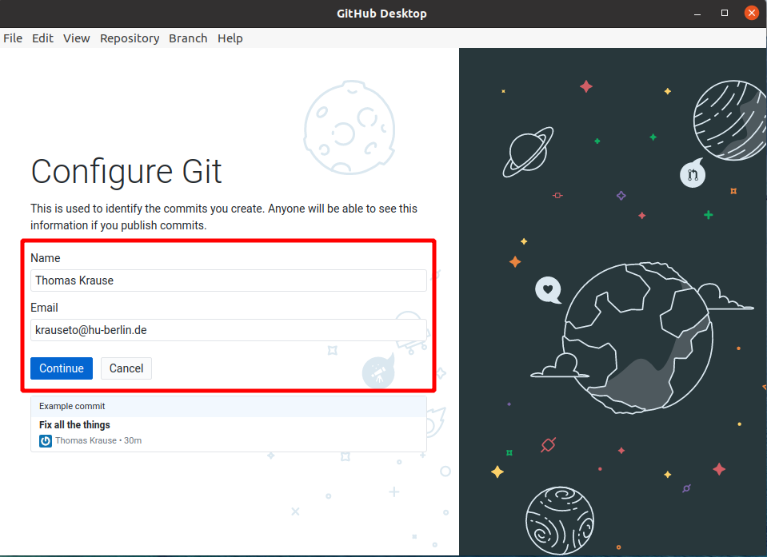
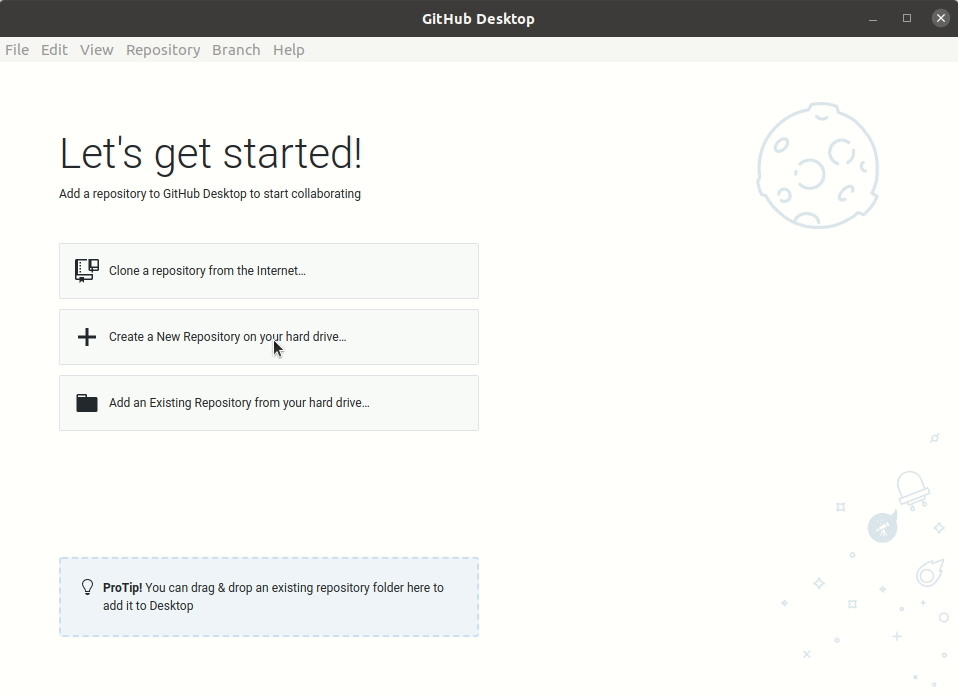

## Einführung und Terminologie

Das Arbeiten an Quelltexten ist typischerweise inkrementell. 
Das führt schnell dazu, dass man Überblick über die verschiedenen Versionen verliert.
Beim Schreiben von Texten gibt es dann oft die Strategie, die Versionierung im Dateinamen auszudrücken (also z.B. "final.doc", "final_rev2.doc", final_final.doc").[^final]
Außerdem benötigen wir bei gemeinsamen Arbeiten in Projekten auch einen gemeinsamen Stand des Quelltexts, auf den alle Projektmitglieder zugreifen können.

[^final]: Zu den Problemen die durch „Versionen“ im Dateinamen entstehen können, sei auch die [PHD Comics Episode dazu](http://phdcomics.com/comics/archive.php?comicid=1531) empfohlen.

Anstatt manuell eigene Versionierungs-Mechanismen zu erarbeiten, können wir auch bestehende Versionskontrollsysteme (VCS) nutzen.
Dieses soll uns in die Lage versetzen
- Änderungen unabhängig vom Dokument betrachten,
- Änderungen in Dokumenten automatisch zu verfolgen,
- Änderungen rückgängig zu machen bzw. „zurückspulen“,
- nachvollziehen zu können, wer in dem Projekte welche Änderungen gemacht hat,
- nicht aus Versehen Änderungen anderer übersehen und/oder überschreiben.

Inzwischen hat sich das Kommandozeilen-Programm Git als de-facto Standard Versionskontrollsystem für Quelltexte etabliert.
Man kann es aber auch für andere Textdatei-lastige Projekte, wie zum Beispiel Korpusannotationsdateien nutzen.

Die Konzepte von Versionsverwaltungsprogrammen folgen einer eigenen Terminologie, die gerade am Anfang etwas überwältigend sein kann.
Im [Glossar](https://help.github.com/en/github/getting-started-with-github/github-glossary) der GitHub-Platform können Sie die wichtigsten Begriffe, die wir auch hier verwenden werden, nachschlagen.
Dazu gehören unter anderem,

- *repository* <https://help.github.com/en/github/getting-started-with-github/github-glossary#repository>
- *clone* <https://help.github.com/articles/github-glossary/#clone>
- *fetch* <https://help.github.com/articles/github-glossary/#fetch>
- *pull*  <https://help.github.com/articles/github-glossary/#pull>
- *commit*  <https://help.github.com/articles/github-glossary/#commit>

##  Tools und Plattformen

Um gemeinsam Quelltexte zu bearbeiten, benötigen wir zwei Dinge: 
- die Software zum Versionieren selbst (in diesem Fall Git)
- einen Ort an dem wir von Git erstellten Repositories abspeichern und von dem wir unsere eigenen Kopien synchronisieren.

Wir werden die grafische Oberfläche [GitHub Desktop](https://desktop.github.com/) (nicht zu verwechseln mit der Online-Platform GitHub.com, aber von der gleichen Firma) nutzen, die Sie von <https://desktop.github.com/> für Ihr Betriebsystem herunterladen können. 
Für Linux werden inoffizielle Installationspakete unter <https://github.com/shiftkey/desktop/releases/> bereitgestellt.
Gleichzeitig werden wir auch immer für jede Aktion in GitHub Desktop den entsprechenden Git-Kommandozeilen-Aufruf zeigen.
GitHub Desktop bringt seine eigene Git-Installation mit.
Wenn Sie die Kommandozeilenbefehle nachvollziehen möchten, müssen Sie deswegen, deswegen müssen Sie Git für die Kommandozeile von <https://git-scm.com/downloads> installieren. Unter Linux ist `git` typischerweise schon in den Paketquellen vorhanden und kann zum Beispiel mit `sudo apt install git` unter Ubuntu installiert werden.

Eine populäre Platform für Git-basierte Projekte ist [GitHub.com](https://github.com/), die zum Konzern Microsoft gehört.
Diese erlaubt inzwischen auch das Erstellen von nicht-öffentlichen Projekten und kann daher auch für eigene Studien-Projekte geeignet sein.
Daneben gibt es aber auch Alternativen wie GitLab, das einerseits eine [zentrale Plattform](https://about.gitlab.com/) analog zu GitHub.com ist, deren Software man aber auch auf eigenen Servern installieren und betreiben kann.
Die HU-Berlin betreibt unter <https://scm.cms.hu-berlin.de/> eine solche GitLab-Instanz auf ihren eigenen Servern, auf der Sie sich mit Ihrem CMS-Acccount einloggen können.
Diese verschiedenen Plattformen haben oft ähnliche Funkionen, wie zum Beispiel Ticketsysteme zum Verwalten von Bugs und TODOs.
In diesem Tutorial werden wir die GitLab-Instanz der HU nutzen, aber das Prinzip ist für die anderen Plattformen gleich.

## Anlegen eines neuen lokalen Git-Repositories

Git arbeitet auf sogenannten *Repositories*, die alle Dateien und die komplette Versionshistorie beinhalten.
Ein Git-Repository besteht aus einem lokalen Ordner mit den zu versionierenden Dateien und einem speziellen versteckten Unterordner `.git`.

Zum Anlegen eines Git-Reppositories, starten Sie GitHub Desktop.
Beim ersten Start wird das Programm Sie auffordern, einen Account auf GitHub.com anzulegen, da wir das GitLab der HU nutzen werden, können Sie diesen Schritt bedenkenlos überspringen.

Trotzdem benötigt Git die Angabe eines Namens und einer E-Mail-Adresse.
Diese Informationen werden in der Versionshistorie als Felder für den Autor angezeigt. 
Beide Angaben werden nur lokal gespeichert und nicht verifiziert, weder der Name noch die E-Mail-Adresse müssen stimmen.

Wählen Sie im Startbildschirm von GitHub Desktop jetzt „Create a new Repository on your hard drive...“ aus, um ein neues Repository als Ordner in einem beliebigen Pfad anzulegen.

Falls bereits ein Repository offen ist, können Sie neue Repositories auch das Menü und "File -> New repository" anlegen.
Auf der Kommandozeile würde man erst einen neuen Ordner erstellen, in diesem mit `cd` wechseln und dann `git init` ausführen, um das gleiche Ergebnis zu erreichen.

~~~bash
mkdir nlp
cd nlp
git init
~~~
~~~
Leeres Git-Repository in /home/thomas/Dokumente/studium/nlp/.git/ initialisiert
~~~
{:.output}

Diesen Ordner können Sie nun wie einen normalen Ordner im Dateisystem benutzen.
Sie können Ihn auch in Visual Studio Code öffnen, um Dateien anzulegen oder zu editieren.
GitHub Desktop bietet einem sogar einen Link an, um das Repository direkt zu in Visual Studio Code zu öffnen

## Dateien hinzufügen und ändern

Legen Sie jetzt eine neue Python-Datei mit dem Namen `main.py` im Repository, zum Beispiel über Visual Studio Code an.
~~~python
name = input("Wie heißen Sie: ")
print("Hallo " + name)
~~~

Im Gegensatz zu Programmen wie Dropbox oder der HU Box müssen Änderungen an den Dateien explizit markiert und in einem Commit zusammengefasst werden.
In GitHub Desktop markiert man dazu die geänderten Dateien, füllt eine Commit-Nachricht aus und comitted die Änderungen.
Dieser Commit ist dann Teil der *History* des Repositories.
Wenn alle lokal geänderten bzw. hinzugefügten Dateien Teil des Commits waren, wird GitHub Desktop "No local changes" anzeigen.

Auf der Kommandozeile werden Änderungen mit `git add <datei>` vorgemerkt und dann mit `git commit -m Nachricht` comitted.
~~~bash
git add main.py
git commit -m "Initial Script"
~~~

Git verwaltet Änderungen zeilenweise.
Sobald eine Datei geändert wird, zeigt GitHub Desktop die geänderten Zeilen an.
Ändern Sie `main.py` so, dass am Ende der Ausgabe ein Ausrufezeichen steht, speichern Sie die Datei ab und GitHub Desktop wird die lokalen Änderungen anzeigen.

Äquivalent dazu ist der Aufruf von `git diff` auf der Kommandozeile.
~~~bash
git diff
~~~

~~~
diff --git a/main.py b/main.py
index f0b5686..936e410 100644
--- a/main.py
+++ b/main.py
@@ -1,2 +1,2 @@
 name = input("Wie heißen Sie: ")
-print("Hallo " + name)
+print("Hallo " + name + "!")
~~~
{: .output}

Markieren Sie auch die neuen Änderungen und committen Sie diese mit einer Aussagekräftigen Commit-Nachricht, zum Beispiel "Added more excitement when welcoming the user.".
In dem Tab "History" listet GitHub Desktop alle Commits mit ihren Nachrichten, dem Autor und den geänderten Zeilen auf.

Jeder Commit hat dabei eine eindeutige ID, in dem Screenshot ist es zum Beispiel `d34119c` für den Commit, in dem das Ausrufezeichen hinzugefügt wurde (unter dem Titel oben rechts im Bild).
Diese ID wird bei Ihnen anders sein, da der Nutzername, die E-Mail, Zeitstempel und alle bisherigen Commits in die Berechnung dieser ID eingehen.
Wenn zwei Commit die gleiche ID haben können Sie sich sicher sein, dass Sie die gleiche Version des Repositories mit dem gleichen Dateiinhalt haben.

Auf der Kommandozeile listet `git log` alle Commits und ihre ID auf.
~~~bash
git log
~~~

~~~
commit d34119cd81d054d02b87dedd6dbff14ef65e93b8 (HEAD -> master)
Author: Thomas Krause <krauseto@hu-berlin.de>
Date:   Tue Jun 9 16:54:04 2020 +0200

    Added more excitement when welcoming the user.

commit f22fe3b7787a10c18039e907474d0cef03785705
Author: Thomas Krause <krauseto@hu-berlin.de>
Date:   Tue Jun 9 16:49:00 2020 +0200

    Initial script
    
    The script just asks the user for its name and prints a welcome message.

commit 561e8c6b06e757868fd31bafa619e7c0b43c01e8
Author: Thomas Krause <krauseto@hu-berlin.de>
Date:   Tue Jun 9 14:36:46 2020 +0200

    Initial commit
~~~
{: .output}

Im Gegensatz zu GitHub Desktop listet `git log` die komplette ID und nicht nur die ersten Zeichen auf.
Zur eindeutigen Identifikation des Commits reichen aber meist die ersten 7 Zeichen.

Sie können lokale Änderungen auch rückgängig machen anstatt Sie zu committed.
Wenn Sie zum Beispiel das Ausrufezeichen in ein Fragezeichen ändern und `main.py` speichern, wird die Änderungen in GitHub Desktop angezeigt.
Sie können dann mit der rechten Maustaste auf die geänderte Datei unter "Changes" klicken und "Discard changes..." auswählen.

Dieser Befehl ändert die Datei auf der Festplatte, weswegen ein extra Bestätigungsdialog erscheint.
Die Kommanzeilenvariante basiert auf dem Befehl `git checkout <version> <file>`, der Dateien in bestimmten Versionen aus dem Repository wiederherstellt.
Wir verwenden die spezielle Meta-Version "HEAD", die für den letzten lokalen Commit steht.

~~~bash
git checkout HEAD main.py
~~~

~~~
1 Pfad von 80b993b aktualisiert
~~~
{: .output}